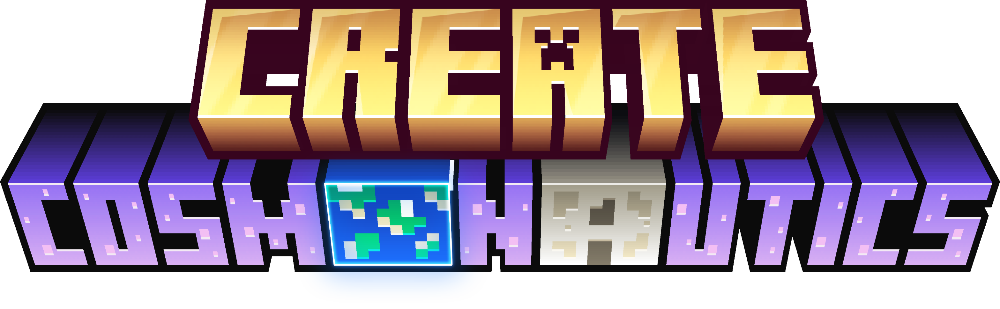

  

# Create: Cosmonautics

  

  

  

  

**Create: Cosmonautics** is a high-fidelity industrial-aerospace expansion for the **Create Aeronautics** mod. It enables the construction of physics-driven launch vehicles, orbital stations, and interstellar exploration systems.

Featuring dynamic rigid body physics, the mod integrates mechanics such as thrust-to-weight ratios, center of mass alignment, and atmospheric drag, providing an immersive aerospace experience within the Minecraft ecosystem.

Fulfill your childhood dream of becoming an astronaut. Build your own rocket and fly it up into the sky, discover what secrets does space have, land on the moon, as well as explore different planets.

---

### Engineering the Cosmos
*   **Realistic orbital mechanics:** Work with space rendezvous, proper transfer windows and correctly executed manuevers.
*   **Dashboard:** Read your current position and trajectory via the holographic table.
*   **Time warping:** Travel through space with quickness and ease.
*   **Exploration:** Visit different moons or planets present in your solar system or outside it.

### Compatibility for addons
*   **Different fuels:** Use mods like TFMG or Create Diesel Generators to improve fuel efficiency.
*   **Data-driven universe:** Easily add new planets or celestial bodies via a datapack. [Wiki](WikiPage)

## Technical Specifications and Requirements

### Dependencies
*   **Java 21**
*   **NeoForge** 21.1.234+
*   **Create** 0.6.10+ (For Minecraft 1.21.1)
*   **Create Aeronautics** (Base mod of Cosmonautics)
*   **Sable API** (Core physics backend)

### Setup for Developers
1. Clone the repository.
2. Synchronize the Gradle project with your IDE (IntelliJ or VS Code). For manual setup, run `./gradlew neoForgeIdeSync` to prepare the environment.
3. Use `./gradlew runClient` to launch a test instance or `./gradlew build` to compile the mod.

---

## License
This project is licensed under the **GNU General Public License v3**. Detailed terms can be found in the [LICENSE](LICENSE) file.
